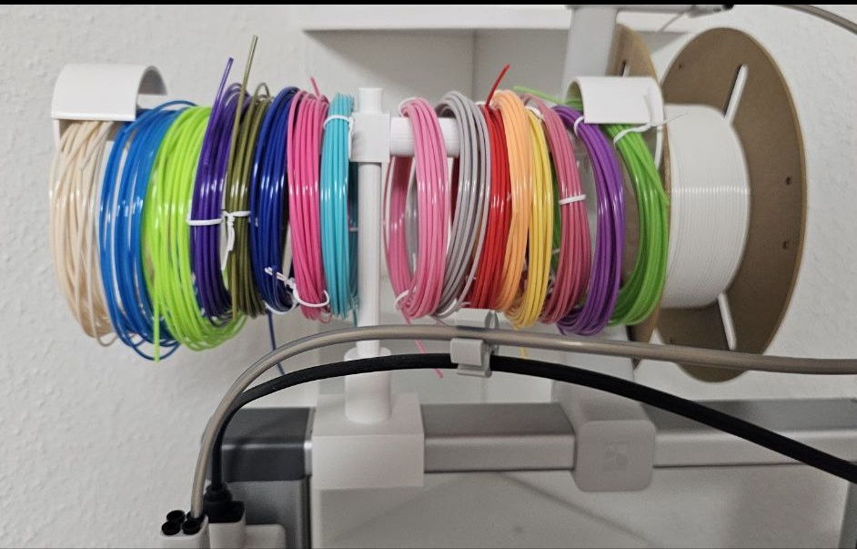
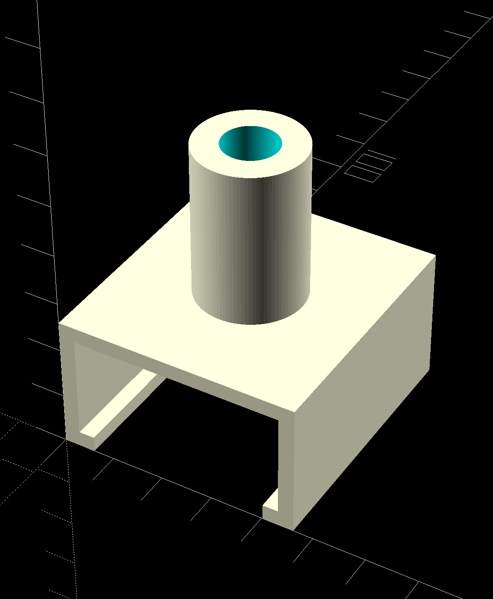
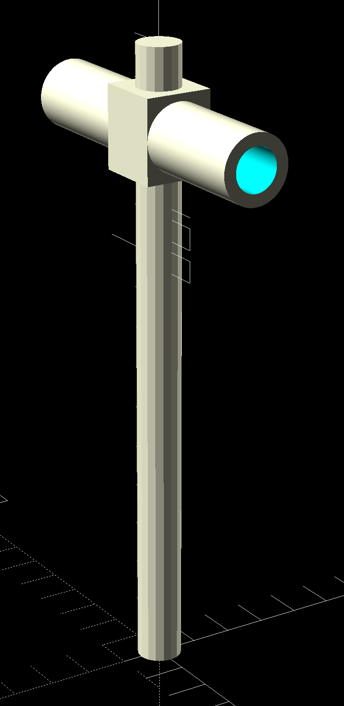
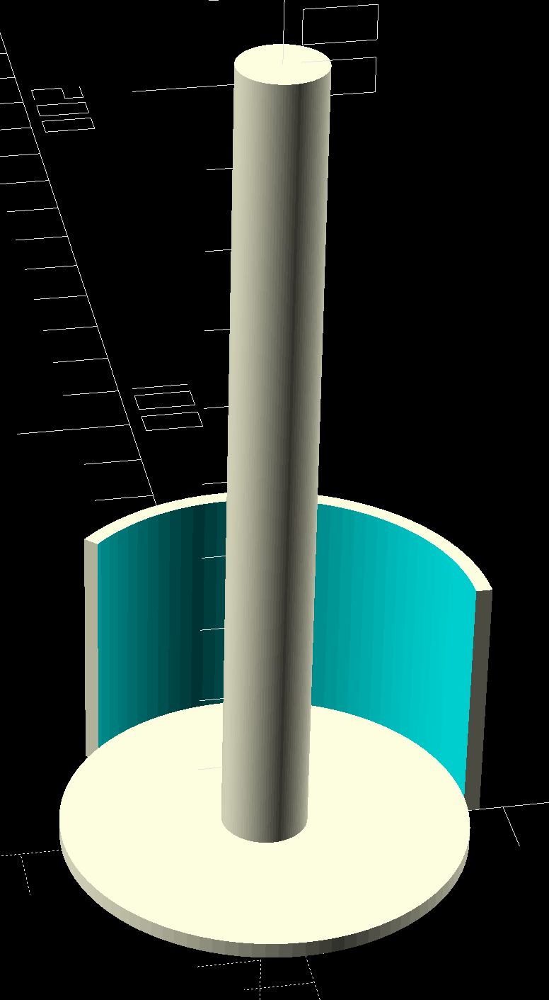
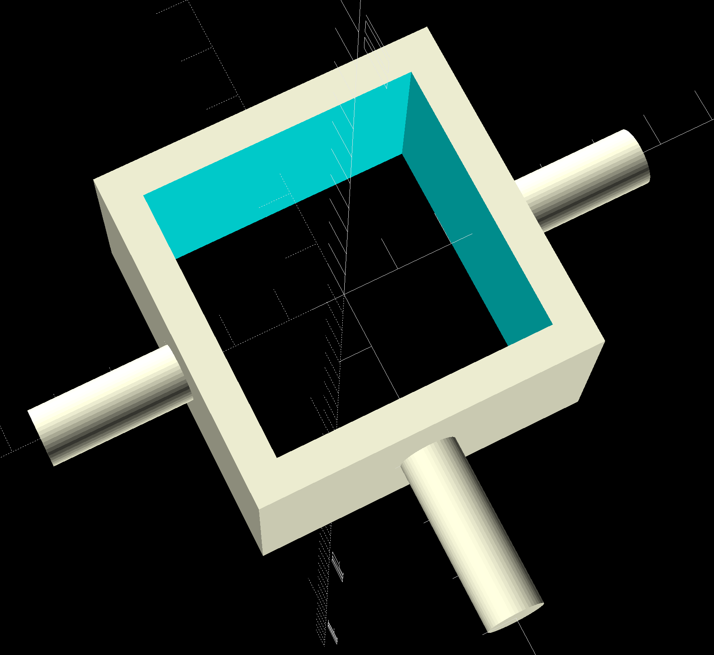
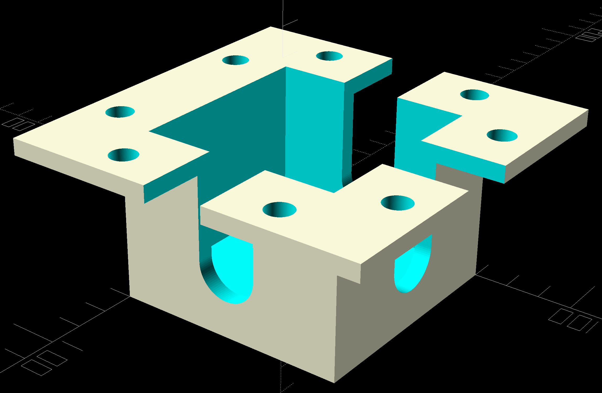

# 3D Modelle Collection

Verschiedene OpenSCAD und diverse andere Modelle für den 3D-Druck.

## Modelle

---
- **BambuLab Basket**  

---
- **[Duschhalterung](models/duschhalterung.scad)**  

---
- **Zahnrad**  

---
- **Arduino Case**  

---
- **Support**  

---
- **Festplatten Käfig**  

---
- **Filament holder for Bambulab A1**  

---
- **Concept DIY Electric Skateboard Conversion Kit**  

 

---
- **[Aditional Screen](models/dockingstation_screen.scad) for [Amazon Product](https://www.amazon.de/dp/B0D9JW1TBL)**  
- **Halterung - WIP**  
  - [Amazon](https://www.amazon.de/dp/B0CC5FZCD9)
- **Pringels Support - WIP**  
